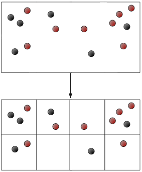
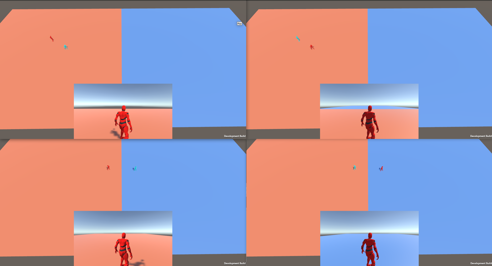
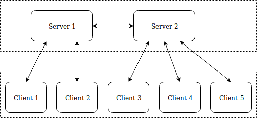
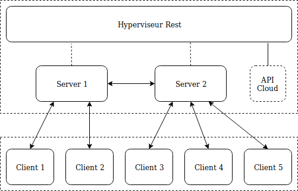
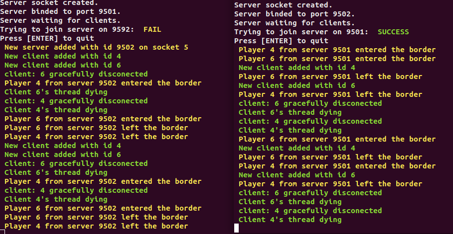

# Unity MMO Demo

This project is a client authoritative event based multiplayer implementation. The idea is to keep the server load as light as possible and divide the load across multiple servers. Instead of having one big server doing all the work we have multiple servers as shown in this picture:

## Client
The client is a unity package made with unity 2018.1 but should worlk with all the recent versions of Unity. It is inspired by Unet's implementation as we wanted to use it in the same way. Each server is a scene loaded as an additive scene. The idea is that the connection to the server is linked to the world and not the player.

For now we only provide spawning and moving player objects but this project could be extended for objects and other messages, the next messages that would need to be added would be RPC's, SyncVar and NetworkedAnimators. 

The result on a scaled down world with 4 clients is shown on the next screenshot:

### Setup
Just clone the repo and open the Client folder with Unity

## Server
The current Server architechture is a simple 2 servers side by side implementation with a lot of hardcoded values. The clients are only connected to one server at a time and if the player is on the border to the other server it's messages are sent by the server to the other server.

To this project in a live environment we would need to add some flexibility on the placement and number of servers. In order to do that we would need to make an hypervisor in charge of distributing id's and creating/stopping servers using a cloud API. This would allow us to optimise the server time and manage player id's and databases.

### Setup
The Server is Unix only, it was made on Ubuntu so it should work on all debian distros but i'm nut sure about other os's (Windows go away).

Compile: `make`

Start server 1: `./Server 9501 9502`

Start server 2: `./Server 9502 9501`

technicly you could add server and change ports of the server but the border managment is hardcoded for server 9501 and 9502. This is due to the fact that this project was a short term school project.

## Licence / Contribute
This is all free to fork/use with no licence do as you want. You can fork, improve and do pull requests as you want and give us a shoutout if you use this.