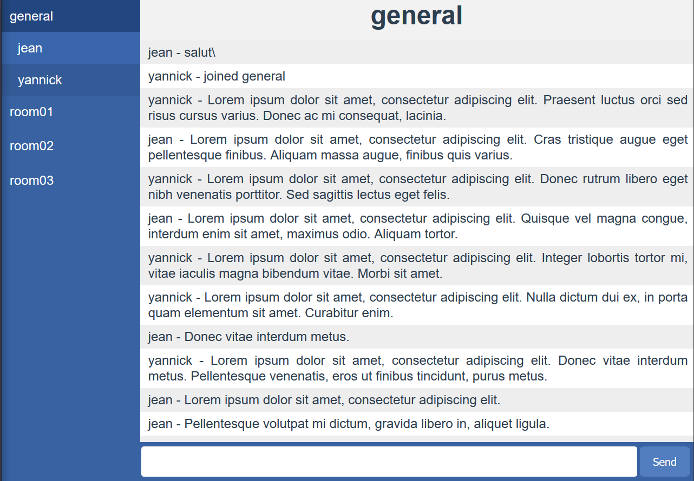
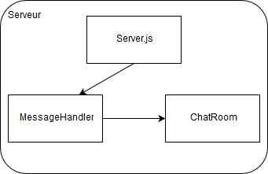
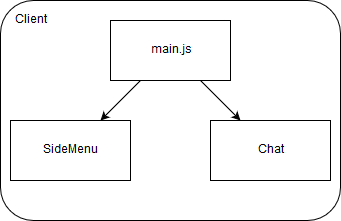

# 8INF843 - TP2 - My-chat

My-chat est un serveur de chat inspiré de Skype, Discord ou slack. L'utilisateur se connecte via une page web qui lui donne accès aux différents salons de discussion.

Demo: http://51.15.247.163:8080/

La charge serveur du chat est repartis sur tous les coeurs du serveur dans des clusters NodeJs. Le serveur démare un processus maitre qui a son tour démare n procesus en charge de gérer les clients en fonction de leur ip. 

```
⚠️ Redis-serveur n'as pas de version stable sous windows ⚠️
```

## Capture d'écran



## Diagrames




- Identification des utilisateurs: Dans cette démo les utilisateurs sont identifés par leur nom d'utilisateur. La seul vérification effectué pour le moment est de vérifier qu'il n'existe pas sur le serveur. Ce choix a pour but de ne pas utiliser de base de données pour simplifier le rendu du tp. Un serveur d'authentification simple permetterait de securiser le nom des utilisateurs dans la métode `sendUsername` dans `ChatComponent.vue`.
- Représentation des données: Comme le Javascript est utilisé pour le serveur et le client les données sont représenté dans des objets JSON. La sérialization des objets est donc simple car tous les objets javascript sont en JSON.
- Gestion des modes de communication: Les messages entre utilisateurs suivent une architecture client-serveur a evenements. Une possibilitée de chat privé entre utilisateurs a été explorée avec la librairie socket.io-p2p mais elle n'a pas été complétée a temps'
- Sécurité: Le meilleur moyen de sécuriser l'application est d'utiliser un certificat ssl pour passer du protocole HTTP au protocole HTTPS supporté par socket.io.

## Backend

Le backend my-chat est développé en NodeJs avec les librairies suivante:
- socket.io: comunication via websocket par evenements
- express: api de creation de serveur REST
- redis: solution de stockage en mémoire pour un accès rapide a la mémoire comune entre les threads
- farmhash: implémentation en NodeJs de la fonction de hashache de google particulièrement avec les IPv6

### installation

- installer NodeJs 10.3.0
- installation des librairies: `npm install`
- démarer le serveur: `node serveur.js`

## Frontend

Le backend my-chat est développé en Javascipt avec les librairies suivante:
- VueJs: framework opensource de developpement d'appliquations `single page`
- Socket.io-Client: comunication via websocket par evenements

### installation

- installer NodeJs 10.3.0
- installation des librairies: `npm install`
- installation de vue-cli: `npm install -g @vue/cli`
- installation de vue-cli-service: `npm install -g @vue/cli-service`
- démarer (Dev): `npm run serve`

### build (Production)

Pour déployer le serveur:
- `npm run build`
- `node serveur.js`